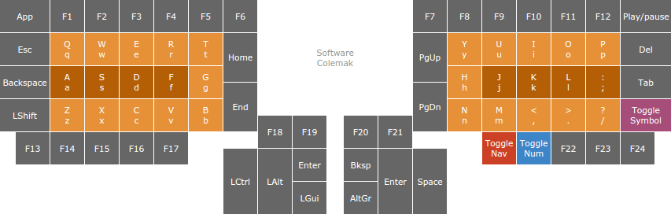

# Keyboard layout for ErgoDox

A [Colemak][colemak]-based keyboard layout for [ErgoDox][why]:

[][reference]

Built using the [ErgoDox firmware created by Ben Blazak][upstream].

  [colemak]: http://colemak.com/
  [ergodox]: http://ergodox.org/
  [reference]: https://docs.google.com/spreadsheets/d/1zPvpUczpZTnQF0VUazGONtYMMnaI0SEXfTjuyOOY8fk/pubhtml?&headers=false
  [upstream]: https://github.com/benblazak/ergodox-firmware
  [why]: https://gist.github.com/datagrok/8130501
